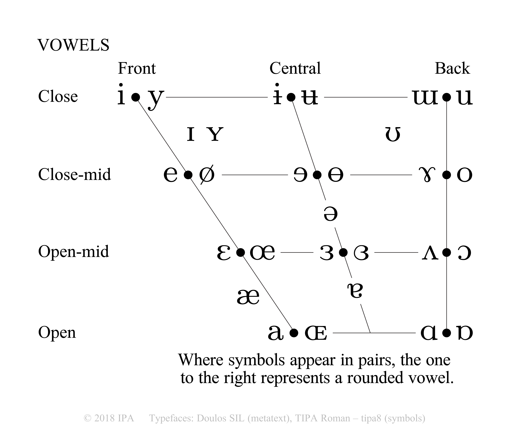

# Correspondence Analysis {#CA}

```{r, include=FALSE}
rm(list = ls())

suppressMessages(library(devtools))
suppressMessages(library(ExPosition))
suppressMessages(library(ggplot2))
suppressMessages(library(corrplot))
suppressMessages(library(ggrepel))
suppressMessages(library(tidyverse))
suppressMessages(library(gridExtra))
suppressMessages(library(grid))
suppressMessages(library(ggplotify))
suppressMessages(library(kableExtra))
suppressMessages(library(knitr))
suppressMessages(library(factoextra))
suppressMessages(library(ggpubr))
suppressMessages(library(data4PCCAR))
suppressMessages(library(PTCA4CATA))
suppressMessages(library(wesanderson))
suppressMessages(library(pander))
suppressMessages(library(abind))
suppressMessages(library(kableExtra))

```

## Intro to CA

Correspondence Analysis (CA) performs a [generalized singular value decomposition](#SVD) on a data table to get principal components. The principal components calculated in this analysis are then used to find factor scores for both the rows and the columns. Because of the organization of the data, the decomposition allows for a visualization of both rows and columns in a single factor space. The CA is a flexible technique originally intended for use on a contingency table, and which has since been adapted for use with other types of qualitative data. The result of this technique is a factor space informed by a polygon with vertices representing the columns and points within that space representing the rows. The Correspondence Analysis is also useful if you find that your data are driven by a single extremely strong dimension. For more information on Correspondence Analysis, see @Abdi2010d and @Abdi2018b.  

### Strengths & Weaknesses
**Strengths**  
  - This technique allows you to analyze qualitative data.  
  - It allows you to visualize row factor scores and column factor scores in the same space.  
 
**Weaknesses**  
  - Interpreting plots is complicated and requires an in-depth understanding of the technique  

### Dos and Don'ts

**Do:**  
  - Remember when you can and cannot compare row factor scores and column factor scores on the same plot.  
  - Make sure that you correctly determine the constraints for plotting your factor scores.  
**Don't:**    
  - Confuse the PCA-type results in terms of principal components and factor scores that compare the rows and columns separately and the scaled 'asymmetric' plots that compare the two directly.  

**Research Questions:**  
Remember that research questions for this analysis should be guided by the fact that we can now compare variables and observations on the same space, in addition to the questions we may want to apply from PCA.  
  - What determines a person's separation of vowel sounds from one another?  
  - Are these factors physical or associational?  
  - Do these factors deal with phonemic information syntactic information, both, or neither?  
  - What guides the color association?  
  - How are colors and vowels related?  
  

##  Data

As stated above, the technique requires data similar to a contingency table. A contingency table is a table that represents the frequency distributions of observations or variables. Because of the nature of this table, the cells can be interpreted either as count data (the number of times a certain observation occurs for a certain variable) or as probability data. It's important to remember that the values represented in the cells, at the intersection of the row and the column represent count data for both the row observation and the column variable simultaneously, the designation of 'observation' and 'variable' is actually dependent on experiment design and whether we use the rows or columns as variables (by transposing the table before analysis) will have effects on our interpretation of the results of the analysis.

```{r, echo = FALSE}
vcdata <- read.csv("VowelsAndColors.csv", header = TRUE)
rownames(vcdata) <- vcdata[,1]
vcdata <- vcdata[,c(2:7)]
vcmat <- as.matrix(vcdata)
vctable <- kable(vcmat,
                format = "latex", booktabs = TRUE) %>%
                kable_styling(latex_options = "striped", full_width = FALSE, position = "float_right")
vctable
```

In this specific dataset, French participants were asked to associate vowels with colors. The participants were presented with six colors and six vowel sounds in words. The participants could associate as many vowels as they wanted with a particular color, but could assign each vowel to only one color. Below is the contingency table that shows how many participants associated each color with each vowel sound. To view these as probabilities, we simply need to look at the numbers in the table as values out of a whole. For example, participants were less likely to associate the "u" sound with yellow than they were to make any other vowel/color association. 


### Colors and Vowels

While not necessary for the Correspondence Analysis per se, these two visuals are important for understanding and interpreting the results. Top is a table showing the french names of the colors and the bottom is the International Phonetic Association's vowel quadrangle. The quadrangle represents a simplified version of where and how in the vocal apparatus a given vowel sound is produced. 

```{r echo=FALSE, ncols = 2, out.width = '49%', fig.show = "hold"}
transtable <- data.frame("English" = c("Yellow", "Green", "Orange", "Blue", "Red", "Violet"), "French" = c("Jaune", "Vert", "Orange", "Bleu", "Rouge",  "Violette"))
transpan <- kable(transtable,
                 format = "latex", booktabs = TRUE) %>%
                 kable_styling(latex_options = "striped", full_width = FALSE, position = "left")


# Turns the table into a graphical object so that it can manipulated with the chunk options
grid.table(transtable, theme = ttheme_minimal(base_size = 24), )
```

### Chi^2^

The ${\chi^2}$ test evaluates how different from a null distribution the data are.
```{r, echo = TRUE}
chi2    <-  chisq.test(vcmat)
```

But remember, ${\chi^2}$ is in counts, but CA analyzes probabilities (i.e., the profiles). So, we need to divide the ${\chi^2}$ statistics by the total sum of the data. Also, the ${\chi^2}$ statistic adds the chi-squares in all cells to give one number. In CA, however, we keep the *pattern* of chi-squares instead of adding all of them up. What we end up with is a table that shows us how much more or less than the average any given cell has occurred. Below are two ways of calculating the ${\chi^2}$ inertia cells. The top uses the values from the results of the test above, the bottom computes them directly from the data.
```{r, echo = TRUE}
# Components of chi2: the chi-squares for each cell 
#                     before we add them up to compute the chi2
Inertia.cells <- chi2$residuals / sqrt(sum(vcmat))

# You can also compute it directly from the data
Z <- vcmat / sum(vcmat) # observed 
r <- as.matrix(rowSums(Z)) # expected for each row
c <- as.matrix(colSums(Z)) # expected for each column
# Inertia.cells 
test.Inertia.cells <- diag( as.vector(r^(-1/2)) ) %*% 
                     (Z - r%*%t(c) ) %*% diag(as.vector(c^(-1/2)))
```

### Correlation Table
**Reading this Plot**  
The correlation table shows us the results of the ${\chi^2}$ analysis. Each of the circles represents the strength (size and opacity) and the direction (color) of the correlation for a column (color) and row  (vowel). These results should be interpreted as how much more or less likely any participant is to associate a given color with a vowel *than the average*, and vice versa. I've used `order = "FPC"` here to show the order in which they load on the first component. As you will see later, both Green and Y are furthest left, and they share a strong positive correlation. Violet and U are furthest right, and also share a strong positive correlation. Notice that Green's correlation values with the vowels gradually move down across the rows, such that it shares a moderate negative association with U.

```{r echo = TRUE, fig.width=5, fig.align="center"}
vc.corr <- corrplot(Inertia.cells, is.cor = FALSE, method = "circle", order = "FPC")
```

## Analysis

Below is the code for the correspondence analysis. Because of how CA works, we have the option of analyzing the data in an asymmetrical or a symmetrical plot. For both of those options, we want to run an Inference battery to test the distributions of our data.

```{r echo = TRUE, message=FALSE, warning=FALSE}
library(InPosition)
vca.sym <- epCA(vcdata, symmetric = TRUE, graphs = FALSE)
vca.asym <- epCA(vcdata, symmetric = FALSE, graphs = FALSE)
vcainf.symI <- epCA.inference.battery(vcdata, symmetric = TRUE, 
                                      test.iters = 1000, graphs = FALSE)
vcainf.symJ <- epCA.inference.battery(t(vcdata), symmetric = FALSE, 
                                      test.iters = 1000, graphs = FALSE)
```

```{r, echo = FALSE}
columncolors <- c(wesanderson::wes_palettes$BottleRocket2[1],
                  wesanderson::wes_palettes$Rushmore1[3],
                  wesanderson::wes_palettes$FantasticFox1[4],
                  wesanderson::wes_palettes$FantasticFox1[3],
                  wesanderson::wes_palettes$Darjeeling1[1],
                  wesanderson::wes_palettes$Rushmore1[4])


sixbrowns <- c(wes_palettes$BottleRocket1[5], wes_palettes$BottleRocket1[5], wes_palettes$BottleRocket1[5], wes_palettes$BottleRocket1[5], wes_palettes$BottleRocket1[5], wes_palettes$BottleRocket1[5])
```

## Results
### Scree Plot
```{r, echo = FALSE, fig.height=4}
my.scree <- PlotScree(ev = vca.sym$ExPosition.Data$eigs,
                      p.ev = vcainf.symI$Inference.Data$components$p.vals, plotKaiser = TRUE, )
```
  
**Reading this plot:**  
A scree plot plots eigenvalues by how much information there is in each component. Each of the dots on the scree plot identifies a dimension from the factor space in which there is variance, there are up to *k* - 1 dimensions from which variance can be extracted, where *k* is the the lower of either the number of variables in your analysis or the number of observations (i.e. min(nrow(DATA), ncol(DATA))), but your analysis of the dataset should focus on only the ones that take up the majority of the variance. A good rule of thumb for this is to look at the eigenvalues that fall above the "elbow", excluding the dimensions that fall below the noise threshold. A good way to visualize this is to connect the dots (as is done in the plot) and draw a straight line that extends from the bottom right hand corner all the way across the graph, and the point at which the dots start to land above this line is the noise threshold.  
On the plot below we see two other methods of determining the significance of each dimension. The first is the Kaiser criterion, where we look at the average of the eigenvalues, plotted as a horizontal line over the plot. This isn't a rule, by any means, but it does give us an idea of what dimensions are important. The second is the result of the permutation tests. The permutation tests tell us whether each of the eigenvalues fall within the most extreme 5% of values. Again, however, this doesn't tell us necessarily what eigenvalues are important, it just shows us what values are significant. It just so happens that in this case, the Kaiser criterion, the elbow test, and the permutation tests are showing us the same dimensionality. Probably a good clue that there are 5 dimensions of data in this set.  
Bottom line is, scree plots give you two things: an idea of the true dimensionality of your data and a measure of the variance explained by the components. Remember that just because the numbers are small, doesn't mean that they can't be significant. The first eigenvalue is in a sense an omnibus test, it shows us whether or not there is any information in the data that isn't just noise. Beyond that, just because there are multiple significant dimensions in this analysis doesn't mean that all of them are worth looking at. It's up to the researcher/observer to determine how many levels we're going to investigate.  
The scree plot shows an interesting case that is an important lesson. The Kaiser criterion (that the eigenvalues must be "above average" to be considered significant) is not accurate here. Testing the *p* values using our inference battery shows us that all five eigenvalues in this case are significant, only the top two are above the average.  


#### Permutation Testing
As you can see below, each of the eigenvalues was tested against the permutations. All are significant in that it is unlikely that they arise by chance. Note that the scale on each of the plots below is different. They've all been scaled so it's possible to see both the permutation bins and the observed values. See the RMD for more info on creating these.

```{r, out.width = "33%", fig.show='hold', ncols = 3}
zeDim = 1
pH1I <- prettyHist(
  distribution = vcainf.symI$Inference.Data$components$eigs.perm[,zeDim], 
           observed = vcainf.symI$Fixed.Data$ExPosition.Data$eigs[zeDim], 
           xlim = c(0, .3), # needs to be set by hand
           breaks = 20,
           border = "white", 
           main = paste0("Permutation Test for Eigenvalue ",zeDim),
           xlab = paste0("Eigenvalue ",zeDim), 
           ylab = "", 
           counts = FALSE,
           cutoffs = c( 0.975))
zeDim = 2
pH2I <- prettyHist(
  distribution = vcainf.symI$Inference.Data$components$eigs.perm[,zeDim], 
           observed = vcainf.symI$Fixed.Data$ExPosition.Data$eigs[zeDim], 
           xlim = c(0, .3), # needs to be set by hand
           breaks = 20,
           border = "white", 
           main = paste0("Permutation Test for Eigenvalue ",zeDim),
           xlab = paste0("Eigenvalue ",zeDim), 
           ylab = "", 
           counts = FALSE, 
           cutoffs = c(0.975))
zeDim = 3
pH3I <- prettyHist(
  distribution = vcainf.symI$Inference.Data$components$eigs.perm[,zeDim], 
           observed = vcainf.symI$Fixed.Data$ExPosition.Data$eigs[zeDim], 
           xlim = c(0, .05), # needs to be set by hand
           breaks = 20,
           border = "white", 
           main = paste0("Permutation Test for Eigenvalue ",zeDim),
           xlab = paste0("Eigenvalue ",zeDim), 
           ylab = "", 
           counts = FALSE, 
           cutoffs = c(0.975))
zeDim = 4
pH4I <- prettyHist(
  distribution = vcainf.symI$Inference.Data$components$eigs.perm[,zeDim], 
           observed = vcainf.symI$Fixed.Data$ExPosition.Data$eigs[zeDim], 
           xlim = c(0, .04), # needs to be set by hand
           breaks = 20,
           border = "white", 
           main = paste0("Permutation Test for Eigenvalue ",zeDim),
           xlab = paste0("Eigenvalue ",zeDim), 
           ylab = "", 
           counts = FALSE, 
           cutoffs = c(0.975))
zeDim = 5
pH5I <- prettyHist(
  distribution = vcainf.symI$Inference.Data$components$eigs.perm[,zeDim], 
           observed = vcainf.symI$Fixed.Data$ExPosition.Data$eigs[zeDim], 
           xlim = c(0, .02), # needs to be set by hand
           breaks = 20,
           border = "white", 
           main = paste0("Permutation Test for Eigenvalue ",zeDim),
           xlab = paste0("Eigenvalue ",zeDim), 
           ylab = "", 
           counts = FALSE, 
           cutoffs = c(0.975))

```

### Factor Plots
#### Constraints
This next chunk shows us how we make the constraints (scale) for the X and Y axes for the factor plots. We're using `minmaxHelper` to get the constraints, and assigning them to `sym` (for symmetrical) and `asym` (for asymmetrical) respectively. For this analysis we're not doing any supplementary analyses, but if we were to do so, the code for those is supplied below. We're setting these up so that the plots display the axes correctly.

```{r, echo = TRUE}
# Here are the factor scores you need
Fj.a <- vca.asym$ExPosition.Data$fj
Fi   <- vca.sym$ExPosition.Data$fi
Fj   <- vca.sym$ExPosition.Data$fj

# constraints -----
# first get the constraints correct
constraints.sym  <- minmaxHelper(mat1 = Fi, mat2  = Fj)
constraints.asym <- minmaxHelper(mat1 = Fi, mat2  = Fj.a)
# constraints.sup  <- minmaxHelper(mat1 = rbind(Fi, HA.sup$fii), 
#                                mat2  = rbind(Fj, punct.sup$fjj) )

colnames(Fi) <- paste("Dimension ", 1:ncol(Fi))
colnames(Fj) <- paste("Dimension ", 1:ncol(Fj))
colnames(Fj.a) <- paste("Dimension ", 1:ncol(Fj.a))
```

#### Asymmetric Plot
**Reading this plot**

Like a PCA, this still plots all of the scores on the principal components, so we can still look at the axes and try to interpret what these principal components are, and how each row and column scores on each factor.  </br>
Unlike a PCA, the asymmetric plot shows us the factor scores of the rows as they relate to the column scores, with the interpretation being that the row scores show how far along the simplex (shaded) in any direction the rows observations score in that column. The simplex facilitates our understanding of the relationship between the rows and the columns in a visual/geometric sense. For more on this specific point, see @Abdi2010d, p. 8. In this case, it shows us how much more likely than average any given participant was to select certain color for a certain vowel. With this plot, we are interpreting the distances from the row points to the column points, relative to the barycenter, as scores along that axis of the simplex. We can always compare rows directly to rows and columns directly to columns, in terms of proximity and squared cosine.  </br>
It's also worth noting that the functions we're using are different: `createFactorMapIJ` and `ggdrawPolygon` from the `PTCA4CATA` package. In code creating the polygon, we can specify the order in which we connect the dots. The order in which the dots are connected automatically is determined by the order in which the variables appear in the data, what we've done here is specify the number of the order in which they appear using the `order2draw` function. </br>

```{r, echo = TRUE, out.width = "80%", fig.align='center'}
asymMap <- createFactorMapIJ(Fi,Fj.a, 
                             col.points.i = wes_palettes$BottleRocket1[5], 
                             col.points.j = columncolors, 
                             alpha.points.i = 1, alpha.points.j = 1, 
                             col.labels.j = columncolors,
                             col.labels.i = wes_palettes$BottleRocket1[5])
zePoly.J <- PTCA4CATA::ggdrawPolygon(Fj.a, order2draw = c(1, 2, 4, 3, 6, 5), 
                                     color = wesanderson::wes_palettes$Moonrise3[1],
                                     fill = wesanderson::wes_palettes$Moonrise3[1],
                                     alpha = .1, size = .2,)
vc.labels <- createxyLabels(resCA = vca.asym)
vcmapiasym <- asymMap$baseMap + zePoly.J + asymMap$I_points + asymMap$I_labels + 
              asymMap$J_points + asymMap$J_labels + vc.labels + 
              ggtitle('Asymmetric Map with Simplex')
vcmapiasym
```


```{r include = FALSE}
#mapSup <- createFactorMapIJ(as.data.frame(HA.sup$fii), 
#                            as.data.frame(punct.sup$fjj)  ,
#                            col.points.i = "Orange",
#                            col.labels.i = 'Orange' ,
#                            font.face.i = 'italic',
#                            alpha.labels.i = .8,
#                            alpha.points.i = .8,
#                            col.points.j = 'Pink',
#                            col.labels.j = 'Pink',
#                            alpha.labels.j = .9,
#                            font.face.j = 'italic',
#                            alpha.points.j = .8,
#                            constraints = constraints.sup)

# If you're going to plot any supplementary points on the factor space, make sure you use the factormap created here as your base map.

```
#### Symmetric Plot
**Reading this plot:**   
In the symmetric plot, we use the transition formula to plot both the row scores and the column scores in the same space. Now, we can interpret distance between row points as similarity and distance between column points as similarity, but we must rely on angles (squared cosines) and distance from the barycenter to interpret the similarity of the rows and columns.  Green and Y are a great example of this - a strong relationship, very small angle and large distance from the origin. If you refer back to the data table at the top, you'll see that the participants were more than twice as likely to pick Green for Y than any other letter, and likewise more likely to pick Y for Green than any other color. Likewise also Yellow and U. Only one person picked U for Yellow, so they are shown to have a strong negative relationship. They are far apart and almost 180 degrees from one another around the origin.
Notice also that the scale for the colors (columns) has changed. In the plot above, the vowels (values for the rows) are essentially plotted inside the column space, but here we've scaled so that both sets of scores are in the same space.  

```{r echo = TRUE, out.width='70%', fig.align='center'}
symMap <- createFactorMapIJ(Fi, Fj, 
                            col.points.i = wes_palettes$BottleRocket1[5],
                            col.points.j = columncolors, 
                            alpha.points.i = 1, alpha.points.j = 1, 
                            col.labels.j = columncolors, 
                            col.labels.i = wes_palettes$BottleRocket1[5])
map.IJ.sym <- symMap$baseMap +
  symMap$I_labels + symMap$I_points +
  symMap$J_labels + symMap$J_points + 
  ggtitle('Symmetric Map') + 
  vc.labels

map.IJ.sym
```


**Side By Side**  

Below are the symmetric and asymmetric plots side by side, so we can compare and contrast the two. This highlights how different types of data can be better or worse suited for different kinds of plots. Because we're looking at how participants assigned vowels to colors, it makes the most sense to interpret this data in the asymmetric map. If the data were different, maybe more stereotypical count data, it might make more sense to plot the rows and columns in the symmetric map so that they can be compared more directly.  

```{r, echo = F, out.width='90%', fig.align='center'}
grid.arrange(as.grob(vcmapiasym), as.grob(map.IJ.sym), ncol = 2, nrow = 1)
```

### Contributions

The section below shows us which of the rows and columns are contributing significantly to the principal components. Where as in PCA, we plotted only the contributions of the columns, in CA, because of the nature of the calculations and the original dataset, we need to calculate the contributions of both the rows and the columns. Note that because of the factor plots we have above, there's no need to plot the circle of loadings for the variables as we do in other analyses. We only need to do the contribution barplots.  

**Reading this Plot**  
  The contribution barplots show you how much each row and column loading contributes to each principal component and identifies visually which of them are significant in this regard. The contributions plotted here are signed, which gives us both the magnitude and the direction of the contribution.  
  This next section arranges the four plots we created in the last chunk in a simple, easy to read grid. As we can see, Y and U seem to be the rows driving component 1, which gives a good clue of how to interpret this, especially in reference to the IPA vowel chart above, and Green is the column driving the first component. Component two is carried primarily by I loading positively on it where as the columns see significant positive contributions from Yellow and Red and significant negative contributions from Orange.  

```{r echo = TRUE, fig.align='center'}
#Get signed components
signed.ctrI <- vca.sym$ExPosition.Data$ci * sign(vca.sym$ExPosition.Data$fi)
signed.ctrJ <- vca.sym$ExPosition.Data$cj * sign(vca.sym$ExPosition.Data$fj)
#Sample contributions code
ctrI.1 <- PrettyBarPlot2(signed.ctrI[,1],
                         threshold = 1 / NROW(signed.ctrI),
                         font.size = 5,
                         color4bar = sixbrowns , # we need hex code
                         ylab = 'Contributions',
                         ylim = c(1.2*min(signed.ctrI), 1.2*max(signed.ctrI))
) + ggtitle("Component 1", subtitle = 'Rows')
```

```{r echo = FALSE}


ctrJ.1 <- PrettyBarPlot2(signed.ctrJ[,1],
                         threshold = 1 / NROW(signed.ctrJ),
                         font.size = 3,
                         color4bar = columncolors, # we need hex code
                         ylab = 'Contributions',
                         ylim = c(1.2*min(signed.ctrJ), 1.2*max(signed.ctrJ))
) + ggtitle("", subtitle = 'Columns')
ctrI.2 <- PrettyBarPlot2(signed.ctrI[,2],
                         threshold = 1 / NROW(signed.ctrI),
                         font.size = 5,
                         color4bar = sixbrowns, # we need hex code
                         ylab = 'Contributions',
                         ylim = c(1.2*min(signed.ctrI), 1.2*max(signed.ctrI))
) + ggtitle("Component 2", subtitle = 'Rows')
ctrJ.2 <- PrettyBarPlot2(signed.ctrJ[,2],
                         threshold = 1 / NROW(signed.ctrJ),
                         font.size = 3,
                         color4bar = columncolors, # we need hex code
                         ylab = 'Contributions',
                         ylim = c(1.2*min(signed.ctrJ), 1.2*max(signed.ctrJ))
) + ggtitle("", subtitle = 'Columns')

```

```{r echo = FALSE, out.width='75%', fig.align='center'}
grid.arrange(
    as.grob(ctrI.1),as.grob(ctrJ.1),as.grob(ctrI.2),as.grob(ctrJ.2),
    ncol = 2,nrow = 2,
    top = text_grob("Contributions", size = 18, face = "bold")
  )
```

### Bootstrapping

There's more on boostrapping in the [Inference PCA](#InfPCA) cookbook page, but bottom line is, with this we're looking to see what the underlying distribution of the data are, and how consistent or generalizable they are; whether or not we can make inferences based on the data. For deeper discussion on bootstrapping, see @Hesterberg2011.

This is the code that calls our bootstrapping data from the inference battery we ran above and plots those data on a similar plot as we see above for the contributions.

```{r echo = TRUE}
#Get Bootstrap Ratios
BR.I <- vcainf.symI$Inference.Data$fj.boots$tests$boot.ratios
BR.J <- vcainf.symJ$Inference.Data$fj.boots$tests$boot.ratios
#Sample Bootstrap Ratio Plot code
laDim = 1
ba001.BR1.I <- PrettyBarPlot2(BR.I[,laDim],
                        threshold = 2,
                        font.size = 3,
                   color4bar = columncolors, # we need hex code
                  ylab = 'Bootstrap ratios'
                  #ylim = c(1.2*min(BR[,laDim]), 1.2*max(BR[,laDim]))
)  + ggtitle("", subtitle = 'Columns')
```


```{r echo= FALSE}
ba002.BR1.J <- PrettyBarPlot2(BR.J[,laDim],
                        threshold = 2,
                        font.size = 3,
                   color4bar = sixbrowns, # we need hex code
                  ylab = 'Bootstrap ratios'
                  #ylim = c(1.2*min(BR[,laDim]), 1.2*max(BR[,laDim]))
) + ggtitle("", subtitle = 'Rows')
laDim = 2
ba003.BR2.I <- PrettyBarPlot2(BR.I[,laDim],
                        threshold = 2,
                        font.size = 3,
                   color4bar = columncolors, # we need hex code
                  ylab = 'Bootstrap ratios'
                  #ylim = c(1.2*min(BR[,laDim]), 1.2*max(BR[,laDim]))
) + ggtitle("", subtitle = 'Columns')
ba004.BR2.J <- PrettyBarPlot2(BR.J[,laDim],
                        threshold = 2,
                        font.size = 3,
                   color4bar = sixbrowns, # we need hex code
                  ylab = 'Bootstrap ratios'
                  #ylim = c(1.2*min(BR[,laDim]), 1.2*max(BR[,laDim]))
) + ggtitle("", subtitle = 'Rows')
```

#### Bootstrap Ratios Plot
**Reading this plot:**
The bootstrap ratios are seen below. All of the columns but Blue load consistently on the first component, likewise all of the columns load consistently on the second component. Similarly, all of the rows but I and E load consistently on the first component, and all of the rows but A and O load consistently on the second component.

```{r echo= FALSE, out.width='80%', fig.align = 'center'}
grid.arrange(
    as.grob(ba001.BR1.I),as.grob(ba002.BR1.J),as.grob(ba003.BR2.I),as.grob(ba004.BR2.J),
    ncol = 2,nrow = 2,
    top = text_grob("Bootstrap Ratios", size = 18, face = "bold")
  )
```

#### All Contributions & Boostrap Ratios
**Reading this Plot**  
The code below plots all eight graphs together for visibility and interpretation. Remember when reading bootstrap ratios and contribution plots that they present different information, even though they look very similar. The contributions represent how much variance each row or column contributes to the principal component. The bootstrap ratios are calculated by computing the mean of the bootstraps divided by the standard deviation (BR = M/S). Essentially, they tell us whether or not the the groups are consistent in how the variable or observation scores. Observations or variables for which the bootstrap ratio is bigger than two are considered stable, and therefore generalizable.  

```{r, fig.width=14}
grid.arrange(as.grob(ctrI.1), as.grob(ctrJ.1), as.grob(ctrI.2), as.grob(ctrJ.2),
             as.grob(ba002.BR1.J),as.grob(ba001.BR1.I),as.grob(ba004.BR2.J),as.grob(ba003.BR2.I),
             ncol = 4,nrow = 2,
             top = text_grob("Contribution & Bootstrap ratios", size = 18, face = "bold"))
```

```{r, echo = FALSE}
#
#savedList <- saveGraph2pptx(file2Save.pptx = 'AllFigures_CA', 
#                            title = 'All Figures for CA', 
#                            addGraphNames = TRUE)

```


## Conclusions

 *  **Component 1**  
    +  It looks like the first component, with regard to the rows/vowels, differentiates along the dimension of vowel placement, whether the vowel is placed further backward or forward in the oral mechanism. Because this is fundamental to the creation of the formants of the vowel, we are in some sense seeing that people are using the timbre of the vowel to differentiate between how they associate vowels with colors.  
    +  The interpretation of the column factor scores for the first component is a little bit more abstract. There could be a number of things that I am not aware of with this dataset, for example, cultural associations with colors in French culture. However, it does look like there's something like the influence of the complexity of the color word on the first component.  

 * **Component 2**  
    + The rows seem to be lining up with Rhyme or sound association. More abstract than the first component for the vowels, but still interesting.  
    + The columns seem to be driving color similarity on the second component, with one exception. Because Orange is almost completely anti-correlated with Yellow, it looks like people are likely to pick *either* yellow or orange for any vowel, but because of experimental design, they can't choose both. 

 * **Interpretation**
    + The two dimensions seem to have to do with timbral aspects of the sounds of the colors and their associated sounds and the semantic associations of colors. I also find it incredibly interesting that the placement of the vowels on the principal component axes that we've created is reflective of that of the placement map.

\newpage 

 * **Symmetric vs. Asymmetric plot**
    + There are important differences between the two factor plots we've put together above. Each compares the data in different ways, and each is suited to different types of data and analyses. As is stated above, because we're looking at how participants assigned vowels to colors, and there is a sense that the rows do in fact depend on the column space, it makes the most sense to interpret this data in the asymmetric map. 
    + If the data were different, maybe more stereotypical count data, it might make more sense to plot the rows and columns in the symmetric map so that they can be compared more directly. There's a great example of this in @Abdi2010d.
